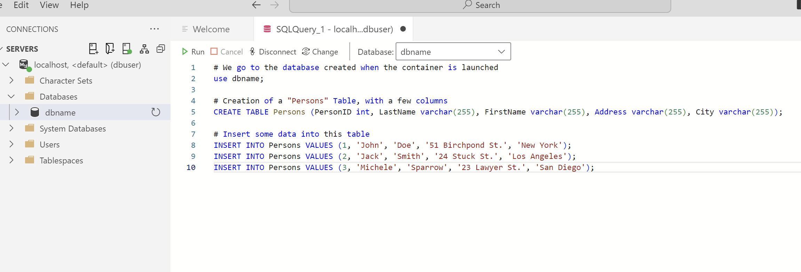
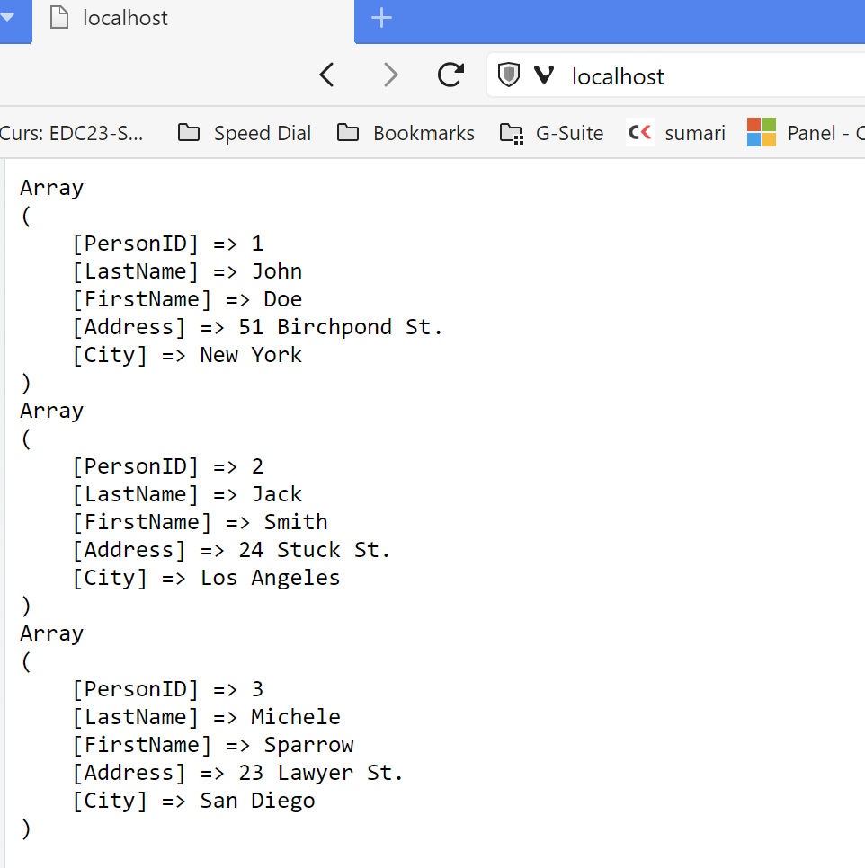

# Docker Compose: PHP & MySQL

Instal·la ràpidament un entorn de desenvolupament local per treballar amb [PHP](https://www.php.net/) i [MySQL](https://www.mysql.com/) utilitzant [Docker](https://www.docker.com).

## Configurar l'entorn de desenvolupament

Es pot utilitzar la configuració per defecte, però en ocasions és recomanable modificar la configuració perquè sigui igual al servidor de producció. La configuració es troba a l'arxiu `.env` amb les següents opcions:

* `PHP_PORT` port pel servidor web.
* `MYSQL_USER` nom d'usuari per connectar-se a MySQL.
* `MYSQL_PASSWORD` clau d'accés per conectar-se a MySQL.
* `MYSQL_DATABASE` nom de la base de dades que es crea per defecte.

### Servidor Aplicacions PHP

Es crea una imatge personalitzada per a PHP a partir de la versió oficial de `php:8.1-apache`.

```Dockerfile
FROM php:8.1-apache
RUN apt update && \
    docker-php-ext-install mysqli pdo pdo_mysql && \
    apt clean
```

Utilitzem la comanda `docker-php-ext-install` per instal·lar les extensions de PHP necessàries per connectar-se a MySQL: mysqli, pdo i pdo_mysql.

La comanda `docker-php-ext-install` és un script especial de shell a la imatge oficial de PHP on PHP s'ha instal·lat des del codi font. Compilarà i instal·larà les extensions necessàries i és la forma recomanada per instal·lar extensions de PHP sobre una imatge oficial de PHP.

## Instal·lar l'entorn de desenvolupament

La instal·lació es fa en línia de comandes:

```zsh
docker-compose up -d --build
```

Pots verificar la instal·lació accedint a: [http://localhost/info.php](http://localhost/info.php)

## Comandaments disponibles

Un cop instal·lat, es poden utilitzar els següents comandaments:

```zsh
docker-compose start    # Iniciar l'entorn de desenvolupament
docker-compose stop     # Parar l'entorn de desenvolupament (no usat habitualment)
docker-compose down     # Para i elimina l'entorn de desenvolupament
docker-compose restart  # Reiniciar l'entorn de desenvolupament
```

## Estructura d'arxius

* `/docker/` conté els arxius de configuració de Docker.
* `/www/` carpeta pels arxius PHP del projecte.

## Accesos

### Aplicació PHP

* `http://localhost/`

### Base de dades

Per accedir al gestor de la base de dades.

* `mysql`: per connexió des de els arxius PHP.
* `localhost`: per connexions externes.

Les credencials per defecte per la connexió són:

| Usuari |  Clau  | Base de dades |
|:------:|:------:|:-------------:|
| dbuser | dbpass |     dbname    |

### Creació de bases de dades

Utilitzant l'extensió `MySQL` per `VSCode` o `Azure Data Studio` ens connectem al servidor de MySQL i creem la base de dades. A l'exemple, ho fem utilitzant `Azure Data Studio`.


Un cop connectats, creem una nova consulta per tal de definir la taula i ompliar-la amb dades.



Podem veure que la taula s'ha creat correctament.


Ara des de l'app de PHP podem veure les dades de la taula.


